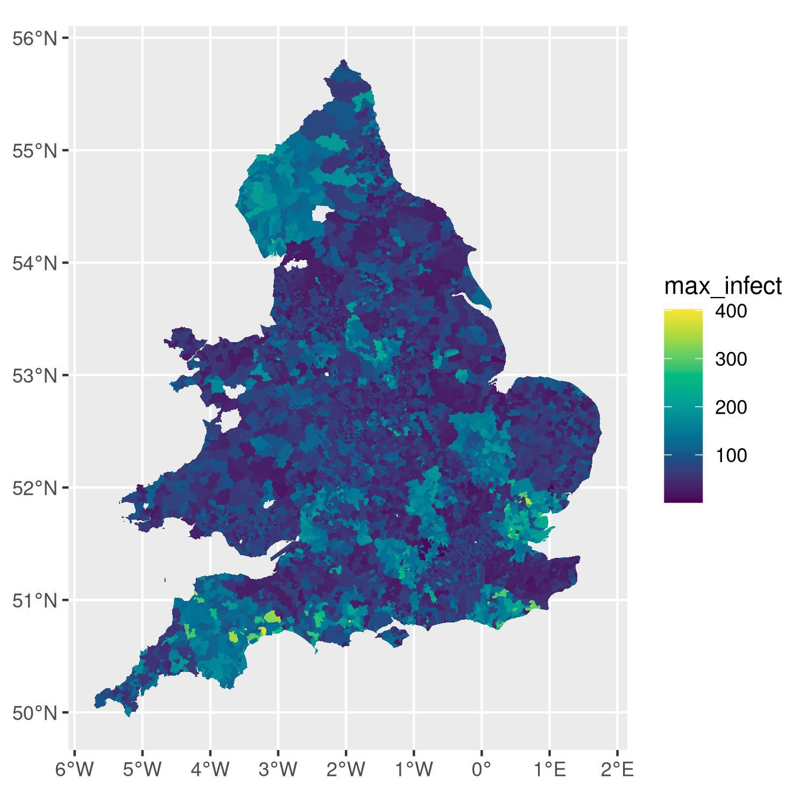

## Load libraries


```r
library(sf)
library(tidyverse)
library(leaflet)
library(htmltools)
```


## Goal

This is a walk-through tutorial to get from MetaWards output to a map plot
(choropleth). The code presented here can be used to write custom functions for
easy plotting of model output.


## Wards boundaries

**Note**: This section is only for completeness, to run the code simply jump to
the next section. 

The 2011 census ward boundaries shapefile were be downloaded from 
[statistics.digitalresources.jisc.ac.uk](https://www.statistics.digitalresources.jisc.ac.uk/dataset/2011-census-geography-boundaries-wards-and-electoral-divisions).
I used the `mapshaper` command line tool (see <https://github.com/mbloch/mapshaper>) to reduce the number of points and thus bring the filesize down from 350Mb to about 12Mb. The mapshaper shell commands used were 

```shell
mapshaper infuse_ward_lyr_2011.shp -simplify visvalingam 0.005 \
          -o force infuse_ward_lyr_2011_coarse.shp
mapshaper infuse_ward_lyr_2011_coarse.shp snap snap-interval=100 \
          -o force infuse_ward_lyr_2011_coarse.shp
```

Then I transformed the spatial polygons data frame to a `sf` object in the proper projection and saved it for later use:


```r
library(rgdal)
wards_sf = readOGR('infuse_ward_lyr_2011', 'infuse_ward_lyr_2011_coarse') %>%
           st_as_sf() %>%
           st_cast('MULTIPOLYGON') %>%
           st_transform('+proj=longlat +datum=WGS84 +no_defs') %>%
	   rename(WD11CD = geo_code)
save(file='wards_sf.Rdata', list='wards_sf')
```


## Load wards data

Download link: [wards_sf.Rdata]({{ base.url }}/vignettes/wards_sf.Rdata')


```r
load('wards_sf.Rdata')
```

An interactive map of the raw wards boundary data can be displayed in the
browser with


```r
# not run:
leaflet(wards_sf) %>% 
  addTiles() %>% 
  addPolygons(col='black', weight=1)
```


## Import Metawards output and calculate maximum number of infections per ward

Next we load a MetaWards model output. Here we use the file
[wards_trajectory_I.csv.bz2]({{ site.baseurl
}}/vignettes/wards_trajectory_I.csv.bz2) from the `0i3v0i0x001` run in the
experiment
[here](https://github.com/UQ4covid/uq4covid/tree/master/ensembles/metawards/output).

The outputs in this experiment are timeseries of number of infections for each
ward. We extract only the `day` and `ward*` columns and calculate the maximum
number of infections per ward:


```r
# load metawards output 
mw_output = read.csv('wards_trajectory_I.csv.bz2')

# transform to tbl and calculate max. number of infections per ward
max_infect = 
  mw_output %>% 
  as_tibble %>%
  select(day, starts_with('ward')) %>%
  gather('ward', 'infect', -day) %>%
  group_by(ward) %>%
  summarise(max_infect = max(infect))
```

Next we remove `ward[0]` and extract the integer index of each ward so we can
later match them with the ward ID from the MetaWards lookup table.


```r
# remove ward 0, extract ward index from col name, and match with ward id
max_infect_ward =
  max_infect %>%
  filter(ward != 'ward.0.') %>%
  mutate(ward_no = as.numeric(str_extract(ward, '\\d+'))) %>%
  arrange(ward_no)
```


## Import ward lookup table

The ward lookup table [Ward_Lookup.csv]({{ site.baseurl
}}/vignettes/Ward_Lookup.csv) was downloaded from
[here](https://github.com/metawards/MetaWardsData/blob/master/model_data/2011Data/Ward_Lookup.csv).
The first column holds the ward id (WD11CD) which we extract and attach to the
maximum infections data frame. The WD11CD is also a column in the wards
boundaries dataso it will be used to combine the data frames later. 


```r
metawards_lookup = read.csv('Ward_Lookup.csv')
metawards_wd11cd = metawards_lookup[,1]
max_infect_ward = max_infect_ward %>% mutate(WD11CD = metawards_wd11cd)
```

### NOTE: not all MetaWards wards are in the boundaries data set

**TODO**: chase this up later, but ok for now


```r
wards_wd11cd = wards_sf$WD11CD
setdiff(metawards_wd11cd, wards_wd11cd)
```

```
##  [1] "E05003230" "E05003216" "W05000053" "W05000055" "W05000058" "W05000068"
##  [7] "W05000080" "W05000081" "W05000082" "W05000083" "W05000084" "W05000088"
## [13] "W05000294" "W05000300" "W05000309" "W05000001" "W05000108" "W05000035"
## [19] "W05000041" "W05000045" "W05000047" "W05000050" "W05000320" "W05000604"
## [25] "W05000954" "W05000958" "W05000896" "E05006972" "E05006554" "E05006566"
## [31] "E05000002" "E05000003" "E05000004" "E05000005" "E05000006" "E05000007"
## [37] "E05000008" "E05000009" "E05000010" "E05000011" "E05000012" "E05000013"
## [43] "E05000014" "E05000016" "E05000017" "E05000018" "E05000019" "E05000020"
## [49] "E05000021" "E05000022" "E05000023" "E05000024" "E05000025" "E05006982"
## [55] "E05008322" "E05008323" "E05008324" "E05008325" "E05008326" "E05005228"
## [61] "E05005246"
```


## Join MetaWards and boundary data sets 

Now matching infection data from the model run to the ward boundaries is a
simple `merge` by `WD11CD`:


```r
# merge data frames
max_infect_df = merge(wards_sf, max_infect_ward, by='WD11CD')
```


## Static plot 


```r
# ggplot object (13Mb)
plt = ggplot(max_infect_df) + 
        geom_sf(aes(fill=max_infect), lwd=0) + 
        scale_fill_gradientn(colours=hcl.colors(n=10))
```


```r
# show
plt
```



```r
# to save:
# ggsave('plot.png', plt)
```


## Interactive plot

To produce a cool interactive, zoomable map with hover effect, use
`leaflet`:


```r
# not run:
palette = colorNumeric(palette="viridis", domain=max_infect_df$max_infect)

max_infect_df = max_infect_df %>%
  mutate(text = paste(name, max_infect, sep=': '))

map = leaflet(max_infect_df) %>% 
        addTiles() %>% 
        addPolygons(fillColor=~palette(max_infect), fillOpacity=0.9, 
                    col='black', weight=2, label = ~htmlEscape(text)) %>% 
        addLegend(pal=palette, values=~max_infect, opacity=1, 
                  title='Maximum no\n of infections')

# to show map in browser do
# print(map)

# save as html widget
htmlwidgets::saveWidget(map, file='metawards_output_map.html')
```

[Link to leaflet map widget]({{ base.url }}/vignettes/metawards_output_map.html)


